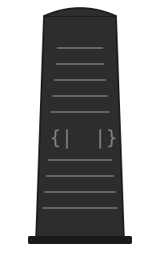

# Stele

<p align="center">
  
</p>

A structural pattern-matching language.

Stele is an experiment in the limits of agentic programming. The entire
language — parser generator, grammar, type system, C code generation, AArch64
native code generation, and a self-hosting compiler — was built collaboratively
with AI. We pushed the experiment as far as writing a complete Stele compiler
*in Stele itself*, one that bootstraps and reaches a fixed point in both C
and native assembly output.

The language is built from first principles. It draws from pattern
calculus and structural subtyping to create a language where pattern matching
is the fundamental operation and all functions accept structural records.
The current compatibility contract is documented in
[`docs/language-semantics.md`](docs/language-semantics.md).

## Quick Start

The primary compiler source is `compiler/main.stele` plus its sibling modules —
a self-hosting Stele compiler written in Stele. If you have built
`build/compiler`:

```bash
# Compile a program to C
./build/compiler examples/hello.stele hello.c
cc -O1 -o hello hello.c && ./hello
# => 25
# => 3628800

# Compile to native AArch64 assembly
./build/compiler examples/hello.stele hello.s asm
cc -O1 -o hello hello.s runtime/runtime.c && ./hello

# Compile to x86_64 assembly
./build/compiler examples/hello.stele hello.s x86
cc -O1 -o hello hello.s runtime/runtime.c && ./hello
```

To bootstrap from source (requires GHC 9.6+ and Cabal 3.10+):

```bash
./bootstrap.sh 2       # C mode (default)
./bootstrap.sh 2 asm   # AArch64 native mode
```

This builds the compiler through multiple generations using the Haskell
bootstrap compiler and verifies a fixed point.

## Stela (Build Tool + Package Manager)

`stela.stele` is a Stele-native build and package tool. It supports
Git-backed local and remote packages.

```bash
stela build <source.stele> [--lib <name> ...]
stela run <source.stele> [--lib <name> ...]
stela check <source.stele> [--lib <name> ...]
stela test <source.stele> [--lib <name> ...]
stela bench <source.stele> [--lib <name> ...]
stela package-lib <source.stele> [--name <name>] [--lib <name> ...]
stela init [--name <name>] [--entry <entry.stele>] [--kind <app|lib>] [--major <n>] [--manifest <path>]
stela add <name> <git-url-or-path> [--ref <git-ref>] [--major <n>] [--manifest <path>]
stela replace <name> <git-url-or-path> [--ref <git-ref>] [--major <n>] [--manifest <path>]
stela install [--manifest <path>]
stela lock [--manifest <path>]
stela graph [--manifest <path>]
stela tidy [--manifest <path>]
stela why <module> [--major <n>] [--manifest <path>]
stela clean
```

Builds still support sandboxing via `sandbox-exec` when available.

### Bootstrapping Stela

```bash
# 1) Build the self-hosted compiler binary (from repo root)
cd bootstrap/haskell && cabal run stele -- ../../compiler/main.stele && cd ../..
mkdir -p build
cc -O1 -o build/compiler compiler/main.c

# 2) Build stela with the self-hosted compiler
./build/compiler stela.stele build/stela.c
cc -O1 -o build/stela build/stela.c
```

### Using Stela

Run from the repo root (the self-hosted compiler reads `runtime/runtime.c` relative
to the current working directory):

```bash
./build/stela build examples/hello.stele --compiler ./build/compiler --mode c
./build/stela run examples/hello.stele --compiler ./build/compiler --mode c
./build/stela check examples/hello.stele --compiler ./build/compiler --mode c
./build/stela test examples/hello.stele --compiler ./build/compiler --mode c
./build/stela bench examples/hello.stele --compiler ./build/compiler --mode c
./build/stela clean
```

### Package Manifest (`stela.pkg`)

`stela` uses a line-based manifest format:

```ini
name=my-app
entry=app.stele
kind=app
major=1
dep=math|https://github.com/example/math.stele.git|main|1
dep=util|../local-util-repo|HEAD|1
replace=math|../forked-math|main|1
```

Sample manifests and sources are included under `examples/packages/`.

Fields:

- `name`: package name
- `entry`: main entry file (`app`) or library entry file (`lib`)
- `kind`: `app` or `lib`
- `major`: package major version (`1`, `2`, ...)
- `dep`: dependency spec: `<module>|<git-url-or-path>|<git-ref>|<major>`
- `replace`: root-level override spec: `<module>|<git-url-or-path>|<git-ref>|<major>`
  - `git-url-or-path` can be a remote URL or local Git repository path
  - `git-ref` is optional; empty resolves as `HEAD`
  - `<major>` is optional when reading older manifests and defaults to `1`

Package and library names are restricted to letters, digits, `-`, and `_`.
Manifest entries must be relative paths without a `..` component, and manifest
fields cannot contain newlines or `|`. `stela` shell-quotes every external
command argument and replaces manifests and lockfiles atomically.

### Package Workflow

Initialize a project manifest:

```bash
./build/stela init --name app --entry app.stele --kind app --major 1 --manifest stela.pkg
```

Add a dependency (local or remote Git):

```bash
./build/stela add math /path/to/math-repo --major 1 --manifest stela.pkg
./build/stela add strings https://github.com/example/strings.stele.git --ref main --major 2 --manifest stela.pkg
./build/stela replace math /path/to/math-fork --ref main --major 1 --manifest stela.pkg
```

Install and lock dependencies:

```bash
./build/stela install --manifest stela.pkg
```

This materializes:

- `.stela/git/<module-v-major>`: cloned package repositories (sanitized key, e.g. `math_v1`)
- `.stela/lib/<module-v-major>.stelib`: packaged library source for each dependency
- `.stela/lib/.deps.stelib`: bundled dependency source (auto-included by build/run/check/test/bench)
- `.stela/lock.pkg`: resolved lockfile with source/ref/commit/entry/sha256 metadata

Resolver behavior:

- Dependencies are resolved transitively (manifests of dependencies are traversed).
- Cycles are rejected during resolution.
- Identity is `<module>|v<major>` so multiple majors can coexist.
- Root `replace=` rules are applied across the whole dependency graph.
- On install, if a lock entry exists for the same module-major and commit, checksum mismatch fails the install.

Inspect the dependency graph:

```bash
./build/stela graph --manifest stela.pkg
./build/stela why math --major 1 --manifest stela.pkg
./build/stela tidy --manifest stela.pkg
```

### Local Library Packaging

Manual local library packaging is still available:

```bash
./build/stela package-lib math.stele --name math
./build/stela build app.stele --lib math --compiler ./build/compiler --mode c
```

Libraries are stored under `.stela/lib/<name>.stelib`.

Bundled standard libraries live under `stdlib/`:

- `stdlib/cli.stele`: CLI helpers for `argc/argv`, flags, and key/value options
- `stdlib/math.stele`: integer math helpers (`abs`, `clamp`, `gcd`, `lcm`, etc.)
- `stdlib/concurrency.stele`: process-level helpers over `spawn/await/sleep_ms`
- `stdlib/assert.stele`: assertion helpers for test targets
- `stdlib/strings.stele`: string helpers (`starts_with`, `ends_with`, `trim`, etc.)
- `stdlib/path.stele`: POSIX-style path helpers (`basename`, `dirname`, `join`, etc.)

Stdlib test targets live under `stdlib/tests/`:

- `stdlib/tests/cli_test.stele`
- `stdlib/tests/math_test.stele`
- `stdlib/tests/concurrency_test.stele`
- `stdlib/tests/assert_test.stele`
- `stdlib/tests/strings_test.stele`
- `stdlib/tests/path_test.stele`

Run stdlib test targets across the supported mode matrix (`c`, `asm`,
`asm-linux`, `x86`, and `x86-linux` where host toolchain support exists):

```bash
./stdlib/tests/run.sh
```

Options: `--mode c|asm|asm-linux|x86|x86-linux`, `--sandbox`, `--no-sandbox`, `--lib <name>`, `--name <name>`, `--manifest <path>`, `--ref <git-ref>`, `--kind <app|lib>`, `--major <n>`.

## The Language

### Vocabulary

| Keyword   | Meaning                                         |
|-----------|------------------------------------------------|
| `struct`  | Named record type declaration                   |
| `oneof`   | Sum type declaration with tagged variants        |
| `test`    | Embedded test declaration                        |
| `import`  | Load a module for qualified access               |
| `open`    | Load a module and expose its public names        |
| `fn`      | Function defined by pattern clauses             |
| `do`      | Effectful entry point (do block)                |
| `case`    | Pattern clause: `case pattern => body`          |
| `end`     | Closes a struct, fn, do block, or match block   |
| `match`   | Inline pattern match expression                 |
| `print`   | Print a value followed by a newline             |
| `write`   | Write a value without a trailing newline        |
| `readln`  | Read a line of input                            |
| `readint` | Read an integer from input                      |
| `let`     | Bind a local variable                           |
| `{\| \|}`  | Record literal delimiters (the "pillars")       |

### Hello, Stele

```
struct Point
  x : Int
  y : Int
end

fn square
  case {| n |} => n * n
end

fn distance
  case {| a : Point, b : Point |} =>
    let dx = a.x - b.x
    let dy = a.y - b.y
    (square {| n: dx |}) + (square {| n: dy |})
end

fn factorial
  case {| n: 0 |} => 1
  case {| n |} => n * (factorial {| n: n - 1 |})
end

do main
  let origin = Point {| x: 0, y: 0 |}
  let there = Point {| x: 3, y: 4 |}
  print distance {| a: origin, b: there |}
  print factorial {| n: 10 |}
end
```

Output:

```
25
3628800
```

### Structural Subtyping

Every function takes a single record argument. Pattern matching determines
which fields are required — any record with *at least* those fields
will be accepted. Extra fields are silently permitted (width subtyping).

```
fn magnitude_sq
  case {| x, y |} => x * x + y * y
end

do main
  -- A 2D point works
  print magnitude_sq {| x: 3, y: 4 |}

  -- A 3D point works too — the extra z field is ignored
  print magnitude_sq {| x: 1, y: 2, z: 3 |}
end
```

### Pattern Matching

Functions dispatch on their argument using `case` clauses. Patterns can
match literal values, bind variables, or destructure records:

```
fn collatz_step
  case {| n |} =>
    let half = n / 2
    match half * 2 == n
      case 1 => n / 2
      case 0 => n * 3 + 1
    end
end
```

`match` is an inline pattern match — it evaluates an expression and
matches the result against a series of `case` clauses, all as a single
expression.

### Sum Types

The `oneof` keyword declares sum types with tagged variants. Each variant
can optionally carry record fields:

```
oneof Shape
  Circle { radius: Int }
  Rect { width: Int, height: Int }
  Point
end

fn area
  case Circle {| radius |} => radius * radius * 3
  case Rect {| width, height |} => width * height
  case Point => 0
end
```

Declared sum types are nominal: values from distinct `oneof` declarations do
not unify merely because their payloads have the same shape. Field access on a
sum is allowed only when every variant has that field with a compatible type.
Functions pattern-match on variants directly, and `match` expressions work
with sum types too.

### Closures

Anonymous functions use `fn ... end`, capture lexical variables, can be
returned from functions, passed as arguments, and stored in records:

```stele
fn make_adder
  case {| base |} =>
    fn case {| n |} => n + base end
end

do main
  let add5 = make_adder {| base: 5 |}
  print add5 {| n: 7 |}
end
```

Closure arguments and captures are separate: a caller field cannot override a
lexically captured name.

### Modules and Signatures

Each source file is a module. `import Math` enables qualified references such
as `Math.square(...)`; `open Math` also makes exported names available
unqualified. Module names map to sibling files by lowercasing the first letter
(`Math` -> `math.stele`). A sibling `math.steli` file restricts exports; without
one, all declarations are public. Circular imports are rejected.

### Embedded Tests

`test "name" ... end` declarations are omitted from normal builds and executed
by compiler test mode or `stela test`. If a file has no embedded tests, test
mode runs its `do main` block. Test execution is currently fail-fast because
`terminate` exits the runner process.

### Mutual Recursion

Functions can freely call each other:

```
fn female
  case {| n: 0 |} => 1
  case {| n |} =>
    n - (male {|
      n: female {| n: n - 1 |}
    |})
end

fn male
  case {| n: 0 |} => 0
  case {| n |} =>
    n - (female {|
      n: male {| n: n - 1 |}
    |})
end
```

## Project Structure

```
stele/
├── compiler/               # Modular self-hosted compiler
│   ├── main.stele          # Compiler entry point
│   └── *.stele             # Front end, type checker, lowering, backends
├── stela.stele             # Build tool + package manager
├── bootstrap.sh            # Multi-generation bootstrap and fixed-point test
├── bootstrap/
│   └── haskell/            # Haskell bootstrap compiler (for initial build)
│       ├── stele.cabal
│       ├── app/Main.hs
│       └── src/Stele/*.hs
├── runtime/
│   └── runtime.c          # Shared native backend runtime
├── stdlib/                 # Standard library
│   ├── cli.stele, math.stele, ...
│   └── tests/
├── examples/               # Example programs
│   ├── hello.stele, match.stele, ...
│   └── packages/
├── book/                   # Language reference book (mdBook)
├── README.md
├── LICENSE
└── logo.svg
```

## Architecture

The compilation pipeline is:

```
Source (.stele) → PEG Parse → AST → Type Check → IR → Backend → cc → Binary
                                                       │
                                                       ├─ C Backend      → .c file
                                                       ├─ AArch64 Backend → .s file + runtime
                                                       └─ x86_64 Backend  → .s file + runtime
```

### Self-Hosted Compiler

The primary compiler begins at `compiler/main.stele`. Its modules implement the
full pipeline — tokenizer, parser, resolver, type checker, C code emitter, and
native code generators (AArch64 and x86-64) — and can compile themselves. A
bootstrap test verifies that
the compiler reaches a fixed point:

```bash
./bootstrap.sh 3        # C mode
./bootstrap.sh 3 asm    # AArch64 native mode
./bootstrap.sh 3 x86    # x86_64 native mode
```

This compiles `compiler/main.stele` through three generations and confirms each
produces identical output.

### Bootstrap Compiler

The Haskell bootstrap compiler lives in `bootstrap/haskell/`. It is used only
to produce the initial `compiler/main.c` from the modular compiler. Once a built
compiler binary is available, the Haskell toolchain is not required.

The bootstrap compiler is a twelve-module Haskell library plus a thin CLI driver:

| Module               | Purpose                                        |
|----------------------|------------------------------------------------|
| `Stele.PEG`          | PEG parser generator, built from scratch       |
| `Stele.AST`          | Abstract syntax tree types                     |
| `Stele.Grammar`      | Grammar definition + parse tree to AST         |
| `Stele.Resolve`      | Module loading, signatures, and name mangling   |
| `Stele.Signature`    | `.steli` export-signature parsing               |
| `Stele.Types`        | Type inference with row polymorphism           |
| `Stele.IR`           | Intermediate representation (basic blocks)     |
| `Stele.Lower`        | AST to IR lowering pass                        |
| `Stele.EmitC`        | C code generation from IR                      |
| `Stele.EmitAArch64`  | AArch64 assembly generation from IR            |
| `Stele.EmitX86_64`   | x86_64 assembly generation from IR             |
| `Stele.Runtime`      | C runtime source for the native backend        |

Building the bootstrap compiler (requires GHC 9.6+ and Cabal 3.10+):

```bash
cd bootstrap/haskell
cabal build
cabal run stele -- ../../compiler/main.stele   # Produces compiler/main.c
```

### PEG Parser Generator

The parser is built entirely from first principles — no Megaparsec, no
Happy, no Alex. Grammars are first-class Haskell values (`Map String PExpr`)
constructed with a combinator EDSL. The engine uses packrat memoization
for efficient parsing and furthest-position tracking for error reporting.

### Type System

The type checker implements Algorithm-W-style unification extended with
Remy-style row types. Record types carry a row variable that permits
additional fields:

```
{| x: Int, y: Int | r |}
```

This row variable `r` is what enables structural subtyping — a function
expecting `{| x, y |}` will accept any record with those fields plus
whatever `r` unifies with.

### Intermediate Representation

Between the type checker and the backends sits an explicit IR with basic
blocks, named temporaries, and flat instructions. Pattern matching, match
expressions, and let-in chains are all resolved at this stage so that
backends are purely mechanical translations.

### Code Generation

**C backend.** The C emitter produces self-contained C with an embedded
runtime. All values are reference-counted tagged unions allocated with
`malloc`. Closures carry a separate lexical-environment record and use the same
ownership rules as other values. Values are immutable, so reference cycles
cannot be constructed with the current language forms and reference counting
is sufficient. The generated code is readable and can be compiled with GCC or
Clang.

**AArch64 backend.** The native emitter supports both Apple and Linux AArch64
assembly syntax. All variables live on the stack in a fixed-size frame per
function. The generated assembly links against a separate C runtime
(`runtime/runtime.c`) that provides the same value representation and reference
counting.

**x86_64 backend.** Supports macOS and Linux (System V) calling conventions.
Links against the same `runtime/runtime.c`.

## Examples

| Example             | Demonstrates                                     |
|---------------------|--------------------------------------------------|
| `examples/hello.stele`     | Structs, functions, construction, postfix calls, pattern matching |
| `examples/subtyping.stele` | Width subtyping, anonymous records              |
| `examples/match.stele`     | Inline pattern matching with fizzbuzz            |
| `examples/mutual.stele`    | Mutual recursion, Ackermann, Collatz, GCD, Fibonacci |
| `examples/oneof.stele`     | Sum types with variants                          |
| `examples/io.stele`        | IO operations                                    |
| `compiler/main.stele`      | Self-hosting compiler entry point                |

## License

See the `LICENSE` file.
